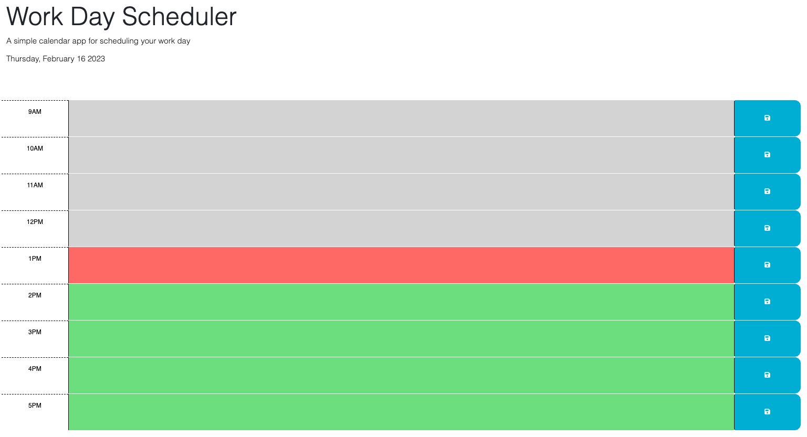

# Work Day Scheduler

## Description

The motivation behind this application was to build a work day scheduler using day.js, jQuery, and our baseline of JavaScript. This project helped me learn more about the use of dayjs and its versatility, as well as how helpful jQuery can be in terms of making long commands short. I was also able to pick apart local storage and how it interacts with different elements of HTML. 

This application provides a convenient way to store your work day schedule on a daily basis. 

[Work-Day-Scheduler](https://lparr30.github.io/work-day-scheduler/)

## Usage

To use this application, simply select the time block for which you would like to schedule an event, type in the information you would like to save, and click the "save" icon on the right. Your information will be stored, so when the page refreshes your events will too!

